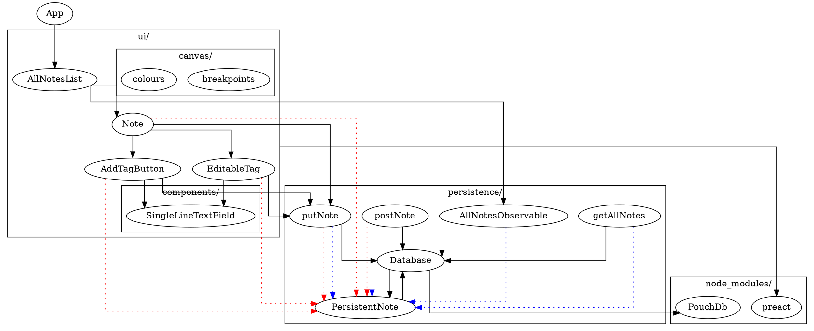

attempting to develop a new architecture based on the dependencies between various artefacts reveals an important problem: although i can think about my dependency graph in two-dimensions and rearrange and explore the graph in my head, it is not possible to achieve this with my filesystem. if we want to embed the dependency graph in the filesystem, we have to organise it using a tree and lists.

## proposed architecture 2

